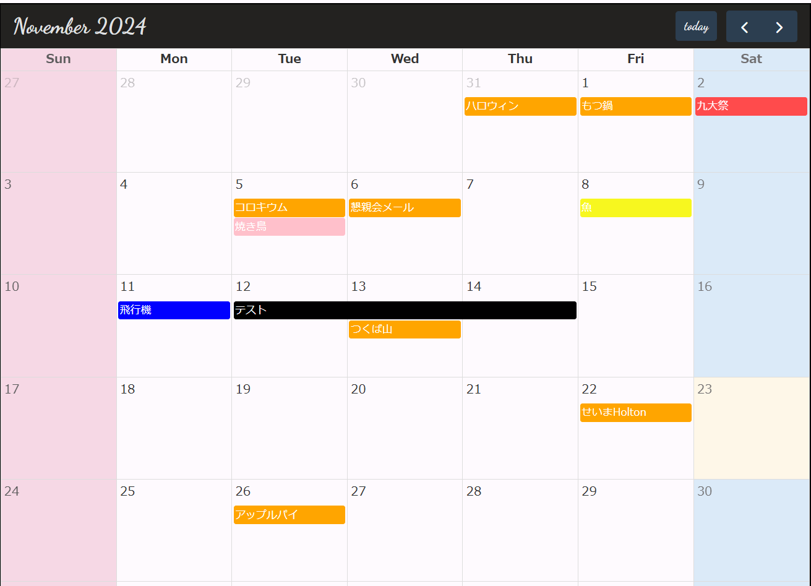

# Calendar App - スケジュール管理アプリ

カレンダーによるスケジュール管理アプリケーションです。<br>
様々なカラーテーマでカスタマイズしながら予定を管理できます。


### 技術スタック

[](https://skillicons.dev)

- React + TypeScript + Vite (frontend)
- PHP + Laravel (backend)
- Heroku (app Hosting, JawsDB MySQL)

### Feature

- シンプルなUI : 簡単に予定を作成、編集
- カラーテーマ : 好みの色でカレンダーをカスタマイズ
- メモ機能 : ひとことメモに最適
  
[Sign up](https://calendar-schedule-app-11c38fd6df5b.herokuapp.com/register)



### 環境構築

以下の手順で環境を構築、ソースコードを利用してください。

#### 初期セットアップ

1. 拡張機能のインストール<br>
   `PHP Server`<br>
   `PHP Intelephense`
2. 環境変数の設定<br>
   ・ `.env`ファイルの作成

   ```
   cp .env.example .env
   ```

   ・ `APP_KEY`の発行

   ```
   php artisan key:generate
   ```

   ・ キャッシュのクリア

   ```
   php artisan config:clear
   ```

   ・ `.env`ファイルの編集<br>

   ```
   APP_KEY=your_issued_app_key
   DB_PASSWORD=your_database_password
   ```

3. PHP ライブラリのインストール
   ```
   composer install
   ```
4. 依存関係のインストール
   ```
   npm install
   ```
5. テーブルの作成
   ```
   CREATE DATABASE calendar_app;  # SQL query
   php artisan migrate            # テーブルの作成
   ```

#### アプリケーションの起動

1. サーバーの立ち上げ
   ```
   npm run dev
   ```
2. 開発サーバーの起動
   ```
   php artisan serve
   ```
